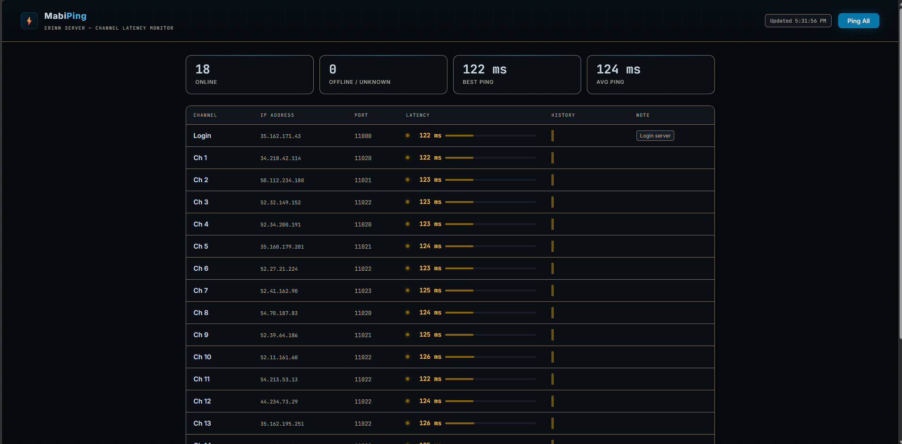

# MabiPing

A lightweight local latency monitor for **Mabinogi (Erinn server)** channels. Pings all channels simultaneously and shows live latency in your browser.


---



## Features

- **TCP ping** all 16 channels + Login + Housing simultaneously
- **Live dashboard** — latency bar, color-coded status (green / amber / orange / offline)
- **Auto-ping** every 30 seconds with live countdown
- **Ping history sparklines** — last 20 pings per channel visualized inline
- **Sort by latency** — click the Latency column header to rank channels
- **5 stat cards** — Online, Offline, Best, Avg, and Worst ping
- **Editable channel list** — update IPs and ports directly in the browser, saved to `channels.json`
- **No npm dependencies** — pure Node.js standard library

## Setup

### Step 1 — Install Node.js (one time only)

Node.js is a free runtime that lets you run this tool. If you've never installed it:

1. Go to **https://nodejs.org**
2. Download the **LTS** version (the left button)
3. Run the installer, click Next through everything, leave all options as default

To check it installed correctly, open Command Prompt and type:
```
node --version
```
You should see something like `v22.0.0`. If you do, you're ready.

### Step 2 — Download MabiPing

Click the green **Code** button on this page and choose **Download ZIP**, then extract it anywhere you like (e.g. your Desktop).

Or if you have Git:
```
git clone https://github.com/RamenFighter03/Mabi-Ping-Tool.git
```

### Step 3 — Run it

Open the folder, then open a Command Prompt inside it:
- On Windows: hold **Shift** and right-click inside the folder, choose **"Open in Terminal"** or **"Open command window here"**

Then type:
```
node server.js
```

You should see:
```
MabiPing running → http://localhost:7799
```

### Step 4 — Open the dashboard

Open your browser and go to **http://localhost:7799**

That's it. The tool will start pinging all channels automatically and refresh every 30 seconds.

> To stop it, press `Ctrl+C` in the terminal window.

## File Structure

```
mabi-ping/
├── server.js          # Node.js server (routes, TCP ping logic)
├── public/
│   └── index.html     # Dashboard UI (HTML/CSS/JS)
├── channels.json      # Created on first save — stores custom IPs/ports
└── package.json
```

## Channel IPs

Default IPs are sourced from the [Mabinogi World Wiki lag page](https://wiki.mabinogiworld.com/view/Lag). If IPs change, use the **Edit Channels** panel in the dashboard to update them — changes are saved locally to `channels.json`.

## Ping Status Legend

| Color | Range |
|-------|-------|
| Green | < 80 ms |
| Amber | 80–179 ms |
| Orange | ≥ 180 ms |
| Red | Offline / timeout |

## License

[MIT](LICENSE)
